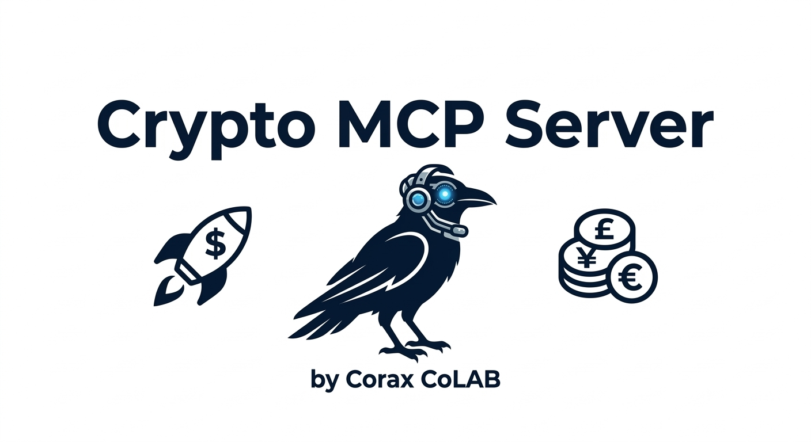
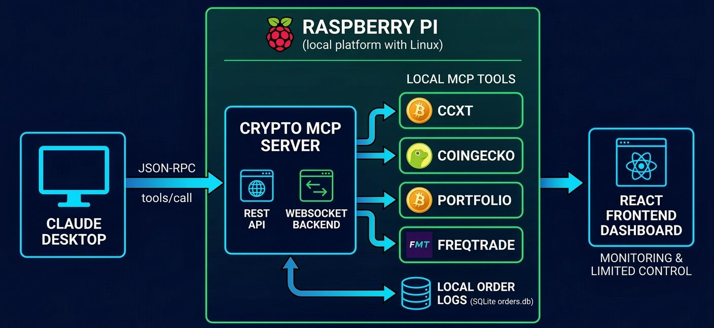
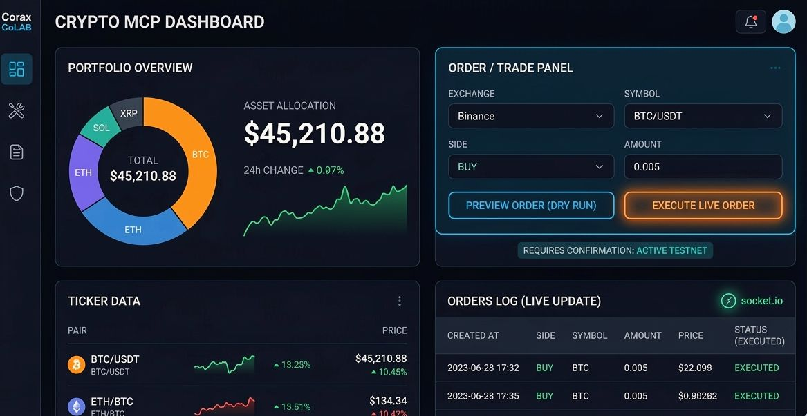
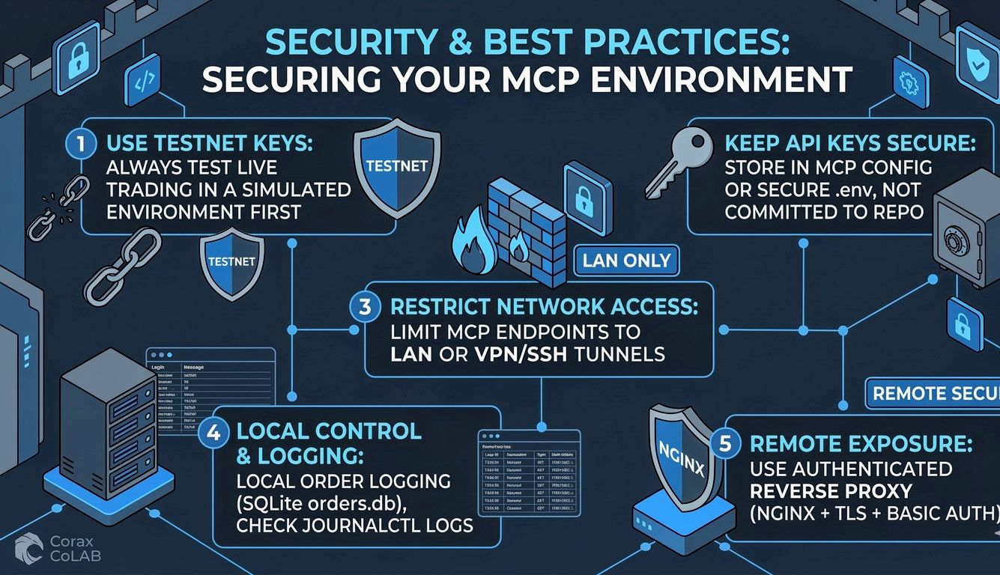

<div align="center">
  <a href="https://coraxcolab.com" target="_blank">
    
  </a>

  <h1>Crypto MCP Server <br> <span style="font-size: 0.6em; color: #10b981;">by Corax CoLAB & PelleNybe 🚀🪙</span></h1>

  <p>
    <a href="https://github.com/PelleNybe"></a>
  </p>

  <p>
    <a href="https://github.com/PelleNybe"></a>
    =3.10-blue.svg?style=for-the-badge&logo=python" />
    =20.x-green.svg?style=for-the-badge&logo=nodedotjs" />
    
    
  </p>

  <p><em>The ultimate AI-driven command center for your local crypto operations, featuring a dark, cyberpunk/command-center aesthetic.</em></p>
</div>

---

## 🗺️ System Overview & Architecture

The image series below illustrates the four key stages of the Crypto MCP Server, a local ecosystem developed by **Corax CoLAB** and **[PelleNybe](https://github.com/PelleNybe)** to bridge AI (Claude Desktop), local tools (on a Raspberry Pi or Linux machine), and blockchain technology.

<details>
<summary><b>1️⃣ Architectural Overview (Click to expand)</b></summary>
<br>
This diagram establishes the foundational flow of the system. It shows how Claude Desktop communicates via JSON-RPC with the Crypto MCP Server backend (REST + WebSocket). The server acts as a proxy, directing traffic to specific local MCP tools—such as CCXT for exchange trading, CoinGecko for market data, and Portfolio for asset aggregation—while logging orders to a local SQLite database.

<div align="center">
  
</div>
</details>

<details>
<summary><b>2️⃣ Installation and Configuration (Click to expand)</b></summary>
<br>
This image highlights the "Quick Start" process. It shows a user physically working with a Linux terminal interface. The terminal displays successful execution steps of the automated `install.sh` script, which automates directory creation, Node.js installation, and service setup.

<div align="center">
  
</div>
</details>

<details>
<summary><b>3️⃣ Security and Best Practices (Click to expand)</b></summary>
<br>
The final infographic summarizes the core security principles for operating the MCP server. It visually maps out essential "best practices": using testnet keys for risk-free simulation, securing API keys, restricting network access (LAN only or VPN/SSH tunnels), leveraging local control, and implementing an authenticated reverse proxy (NGINX).

<div align="center">
  
</div>
</details>

---

<div align="center">
  
</div>

**Crypto MCP Server** is a local, lightweight dashboard + utility layer that connects **Claude Desktop (Local MCP tools)** and your local MCP servers on a Raspberry Pi (or other platforms with a Linux distro). It provides a REST + WebSocket backend that proxies MCP tools (CCXT, CoinGecko, Portfolio, Freqtrade, etc.), stores order logs locally (SQLite), and ships a **cyberpunk-themed React frontend dashboard** for monitoring and advanced AI-driven control.

> 📁 **Default project path:** `$HOME/cryptomcpserver/`
> 🎯 **Installer script:** `install.sh` (located at `$HOME/install.sh`)

---

## 🌌 New AI Capabilities & Interactive Elements

The Crypto MCP Server now features advanced interactive elements and real-time AI capabilities embedded directly into the UI:

*   🤖 **Oracle Copilot:** An interactive, voice-activated AI terminal (`OracleCopilot.tsx`) that analyzes commands, executes dry runs, and queries TA/On-chain MCPs. Features real-time voice recognition and a sleek CRT terminal UI.
*   🌊 **Whale Sonar Sweep:** Dynamic visual tracking of real-time trending coin activity utilizing deterministic radar representations.
*   🌦️ **Global Weather System:** An interactive background system that reacts to the current market sentiment (Bull, Bear, Neutral), altering the entire visual environment.
*   ⚛️ **Quantum Risk Map:** Real-time 3D topography of your portfolio risk exposure using real-time Technical Analysis (RSI, Bollinger Bands) from the local MCP backend.
*   🌀 **Arbitrage Wormhole:** Live Cross-DEX arbitrage detection using multi-exchange CCXT MCP polling.
*   ✨ **Cyberpunk UI Polish:** The entire dashboard is wrapped in a dark, glowing aesthetic with glassmorphism, animated CRT scanlines, and reactive hover states.
*   👁️ **System Overview:** A high-level visual summary of your entire crypto operation, including system status, active agents, and total equity.
*   🧠 **Neural Net Liquidity:** Real-time visualization of market liquidity using a simulated neural network topography.
*   📊 **Holo Topographic Order Book:** A 3D, holographic representation of the order book, now integrated with real-time live data from CCXT MCP endpoints.
*   📰 **News Singularity:** An AI-curated feed of the most critical market news, sentiment-scored using live data endpoints via CoinGecko.
*   🛰️ **Orbital Portfolio:** A dynamic, physics-based 3D visualization of your actual asset allocation using live real-time portfolio MCP data.
*   🐋 **Whale Constellations:** Real-time 3D mapping of trending coins and market sentiment based on live CoinGecko data endpoints.

---

## 📚 Table of contents

- [Overview & features](#overview--features)
- [Repository layout](#-repository-layout-what-you-should-have)
- [✅ Quick start — automated (install.sh)](#-quick-start--automated-recommended--installsh-)
- [Manual install (condensed)](#-manual-install-condensed)
- [Configuration (.env) & MCP endpoints](#-configuration-env-backend)
- [🔗 Claude Desktop integration (step-by-step)](#-claude-desktop-integration-detailed-)
- [Dashboard user manual](#-dashboard--what-you-can-do-user-manual)
- [REST API examples](#-rest-api-examples-curl)
- [SQLite & logs](#-sqlite--logs)
- [Systemd & services](#-systemd-service-backend)
- [Troubleshooting & common errors](#️-troubleshooting--common-errors)
- [Security & best practices](#-security--best-practices)

---

## 📁 Repository layout (what you should have)

```text
$HOME/cryptomcpserver/
└─ gui/
   ├─ backend/
   │  ├─ server.js
   │  ├─ package.json
   │  ├─ .env.example
   │  └─ orders.db
   └─ frontend/
      ├─ package.json
      ├─ vite.config.ts
      ├─ index.html
      └─ src/
         ├─ main.tsx
         ├─ App.tsx
         ├─ styles.css
         └─ components/
            ├─ PortfolioPanel.tsx
            ├─ TickerPanel.tsx
            ├─ OrderPanel.tsx
            ├─ OrdersLogPanel.tsx
            └─ features/         # Advanced AI & Visual Components
               ├─ SystemOverview.tsx
               ├─ NeuralNetLiquidity.tsx
               ├─ HoloTopographicOrderBook.tsx
               ├─ NewsSingularity.tsx
               ├─ OrbitalPortfolio.tsx
               ├─ WhaleConstellations.tsx
               └─ ... (other features)
```

---

## ✅ Quick start — automated (recommended) — install.sh 🎯

Place the provided `install.sh` into `$HOME/install.sh` (or `$HOME/cryptomcpserver/install.sh` if you prefer). Make it executable and run it:

```bash
# Save install.sh to $HOME/install.sh, then:
cd $HOME
chmod +x install.sh
./install.sh
```

**What install.sh does (summary):**
1. Creates directories and writes backend & frontend files.
2. Installs Node.js if missing and runs `npm install` for backend & frontend.
3. Ensures the `orders` table exists in `$HOME/cryptomcpserver/gui/backend/orders.db`.
4. Frees port 4000 if occupied, then installs & enables the systemd service `crypto-mcp-gui.service`.
5. Attempts a production build of the frontend.

> After running, check service status and logs:
```bash
sudo systemctl status crypto-mcp-gui.service
sudo journalctl -u crypto-mcp-gui.service -f
```

---

## 🛠 Manual install (condensed)

If you prefer to do everything yourself:

1. **Install system deps:**
   ```bash
   sudo apt update
   sudo apt install -y curl build-essential ca-certificates git
   ```

2. **Install Node.js (if needed):**
   ```bash
   curl -sL https://deb.nodesource.com/setup_20.x | sudo -E bash -
   sudo apt install -y nodejs
   node -v
   ```

3. **Backend:**
   ```bash
   cd $HOME/cryptomcpserver/gui/backend
   npm install
   cp .env.example .env
   # edit .env if needed
   ```

4. **Frontend (dev):**
   ```bash
   cd $HOME/cryptomcpserver/gui/frontend
   npm install
   npm run dev -- --host   # open http://PI_IP:5173 on your laptop
   ```

5. **Systemd (backend):**
   ```bash
   # Create /etc/systemd/system/crypto-mcp-gui.service
   sudo systemctl daemon-reload
   sudo systemctl enable --now crypto-mcp-gui.service
   ```

---

## ⚙️ Configuration: .env (backend)

Copy and edit `$HOME/cryptomcpserver/gui/backend/.env.example` → `.env`:

```env
MCP_CCXT=http://127.0.0.1:7001/mcp
MCP_PORTFOLIO=http://127.0.0.1:7004/mcp
PORT=4000
```

*   `MCP_CCXT` — CCXT MCP endpoint (for get_ticker, create_order, etc.)
*   `MCP_PORTFOLIO` — optional portfolio aggregator MCP
*   `PORT` — backend port (default 4000)

---

## 🔗 Claude Desktop integration (detailed) 🧩

### Overview
Claude Desktop supports Local MCP Servers (HTTP JSON-RPC endpoints). Add your MCP endpoints in Claude Desktop so Claude can call the tools exposed by those MCPs (e.g., `get_ticker`, `create_order`).

### Add MCP servers in Claude Desktop (step-by-step)
1. Open Claude Desktop app.
2. Open App Settings / Preferences.
3. Find Local MCP Servers.
4. Click `+` (Add) — fill fields one by one:
   *   **Name:** `ccxt`
   *   **Description:** `CCXT MCP – exchange trading & market data`
   *   **Transport:** `http`
   *   **Endpoint:** `http://127.0.0.1:7001/mcp` (if Claude runs on Pi) or `http://<pi-ip>:7001/mcp` (if Claude runs on laptop)
5. Save. Repeat for other MCPs (`coingecko`, `portfolio`, `freqtrade`, `octobot`, `hummingbot`, `superalgos`, `llm`) with their respective ports.

### Example endpoints to add
*   `http://127.0.0.1:7001/mcp` — ccxt MCP
*   `http://127.0.0.1:7010/mcp` — coingecko MCP
*   `http://127.0.0.1:7004/mcp` — portfolio MCP
*   `http://127.0.0.1:7015/mcp` — llm MCP (Open Source AI functionality)

---

## 🖥 Dashboard — what you can do (user manual)

*   📊 **Portfolio:** View aggregated balances & USD value (updated via portfolio MCP).
*   📈 **Ticker:** Live market data (via ccxt MCP).
*   🛒 **Order / Trade:**
    *   **Preview (dry_run):** Calculates estimated cost and logs a preview to orders.db.
    *   **Confirm → Place order:** Sends create_order to CCXT MCP (backend requires `execute:true`).
*   📜 **Orders log:** Shows previews and executed orders (real-time updates via socket.io).
*   🤖 **AI Copilot:** Voice-activated command center for insights and analysis.

> ⚠️ **Safety:** Always test with testnet keys. The UI requires confirmation to execute live orders.

---

## 🔁 REST API examples (curl)

**Ticker:**
```bash
curl "http://127.0.0.1:4000/api/ticker?exchange=binance&symbol=BTC/USDT"
```

**Portfolio:**
```bash
curl "http://127.0.0.1:4000/api/portfolio?exchanges=binance"
```

**Execute order:**
```bash
curl -s -X POST http://127.0.0.1:4000/api/order/execute \
  -H 'Content-Type: application/json' \
  -d '{"exchange":"binance","symbol":"BTC/USDT","side":"buy","type":"market","amount":0.001,"execute":true}' | jq
```

---

## 🗄 SQLite & logs

**DB file:** `$HOME/cryptomcpserver/gui/backend/orders.db`

**Inspect last 10 orders:**
```bash
sqlite3 $HOME/cryptomcpserver/gui/backend/orders.db \
  "SELECT id,created_at,exchange,symbol,side,amount,price,status FROM orders ORDER BY created_at DESC LIMIT 10;"
```

**Check backend logs:**
```bash
sudo journalctl -u crypto-mcp-gui.service -f
```

---

## ⚠️ Troubleshooting & common errors

*   **Service crashes on start** → check `journalctl -u crypto-mcp-gui.service -n 200`. Common issues: missing npm dependencies, syntax errors, or port 4000 already in use.
*   **EADDRINUSE (port 4000 occupied)** → find and kill the process:
    ```bash
    sudo lsof -i :4000
    sudo kill -9 <PID>
    ```
*   **Claude cannot call MCP** → ensure Claude can reach the Pi (use LAN IP or SSH tunnel), and that you added the MCP via the `+` button.

---

## 🔒 Security & best practices

*   Use testnet keys while testing.
*   Keep API keys out of repo — store them in the MCP server config or in secure `.env` not committed.
*   Restrict access to MCP endpoints to LAN only (UFW rules) or use VPN/SSH tunnels.
*   For remote exposure: use an authenticated reverse proxy (NGINX + TLS + basic auth) — **do not open trading endpoints publicly without robust auth.**

---

<div align="center">
  <h3>Explore the Source 🌐</h3>
  <a href="https://github.com/PelleNybe">
    
  </a>
  <a href="https://coraxcolab.com">
    
  </a>
  <br><br>
  <p>
    <i>This product is proudly brought to you by <b>Corax CoLAB</b> and <b>PelleNybe</b>, the architects behind cyber-physical systems that secure your future in an increasingly regulated and resource-constrained world.</i>
  </p>
  <p>
    <b>We unite:</b><br>
    🤖 Edge AI & Autonomous Systems<br>
    ⛓️ Blockchain & Web3 Innovation<br>
    🛡️ Zero Trust Security (Post-Quantum Cryptography ready)<br>
    🌱 Sustainability & Compliance-as-Code
  </p>
  
</div>
